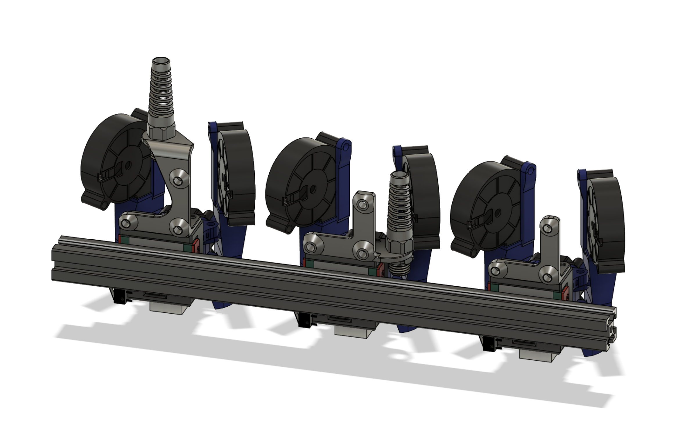

**Huvud Mounting Brackets for Mantis**

The high centered umbilical bracket has the best look overall, but will chew into Z a little bit.  If you never use your full Z, you might not care.

The low rider umbilical bracket should allow full Z usage.

The plain bracket is provided as a starting point, or for someone with another solution already.  I don't think any of these will work with cable chains on X.
