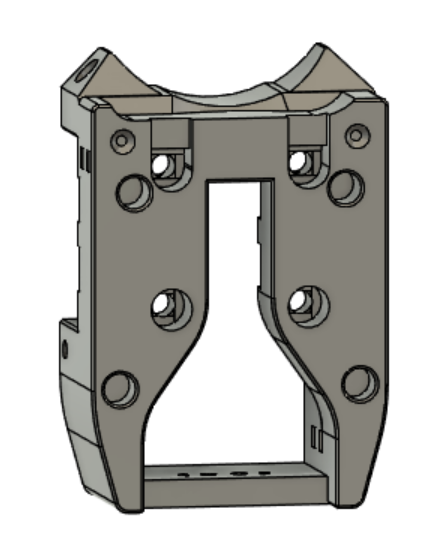
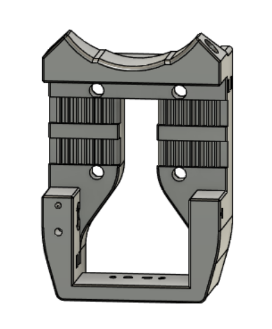
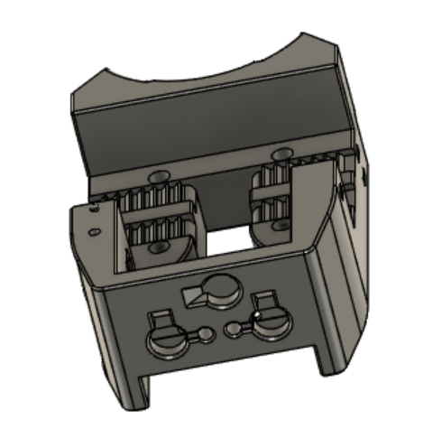

**LGX Lite and Klicky Carriage for Mantis**

This is a straightforward combination of TheWarolf's LGX Lite Carriage with the current version of my Klicky Carriage.  Be sure to use the included dock mount for Klicky, as it positions things at the right height to match this carriage.  Use the current version of of Klicky and it's dock to go with these parts.
