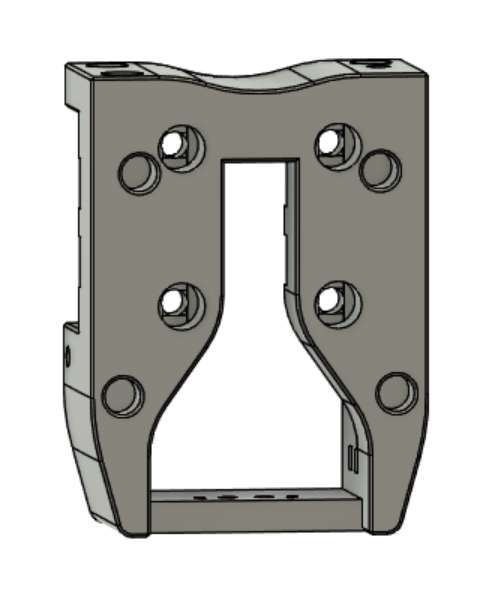
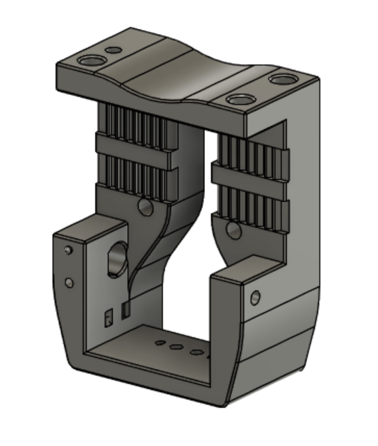
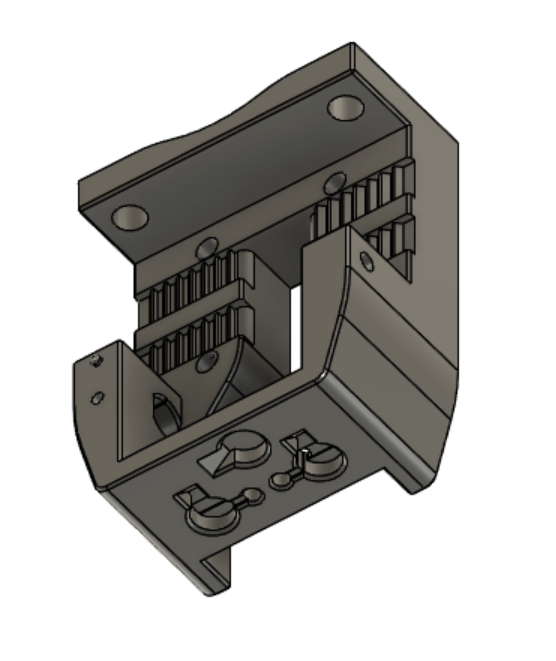
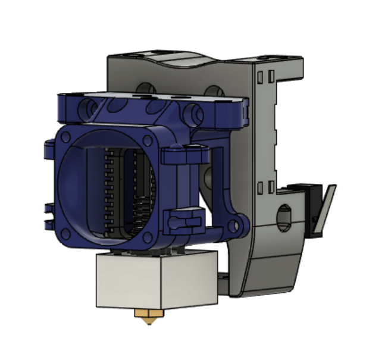
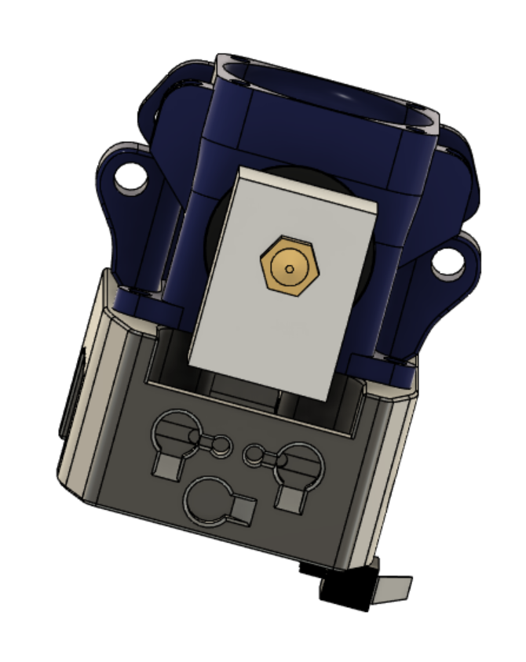
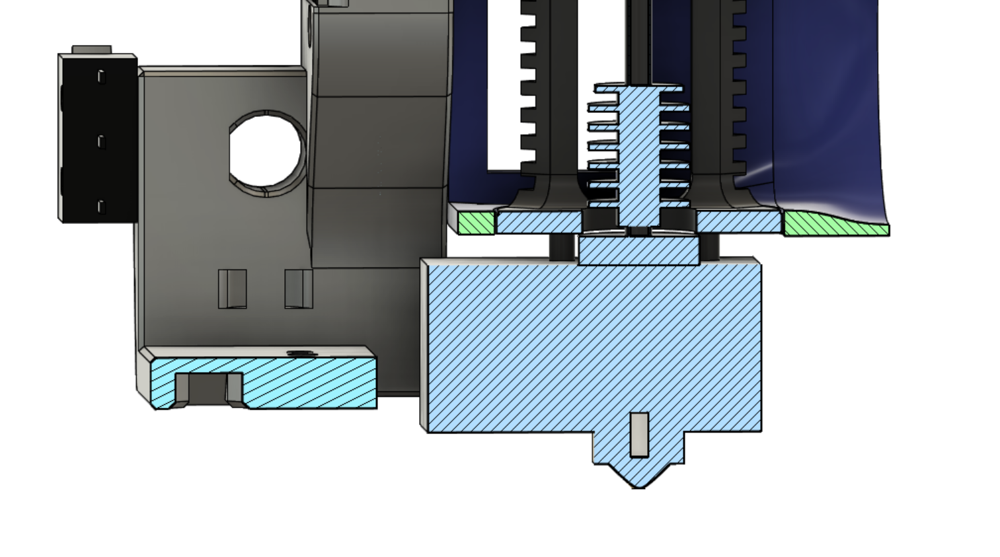

**Mantis Carriage for Klicky**

I love Mantis, but have an ecosystem of printers that use Klicky.  This is my solution to the problem. 

This is a new version of my carriage.  The first version didn't take the hotend fully into consideration, and forced you to turn the Dragon heatblock the wrong way.  It worked fine, but it wasn't right.  This fixes that, and clears the Dragon block easily in the correct orientation.

Be sure to use one of the included Klicky dock mounts.  It will place the dock at the correct height for this carriage.  Use the current Klicky probe and dock from Josar's repo.
