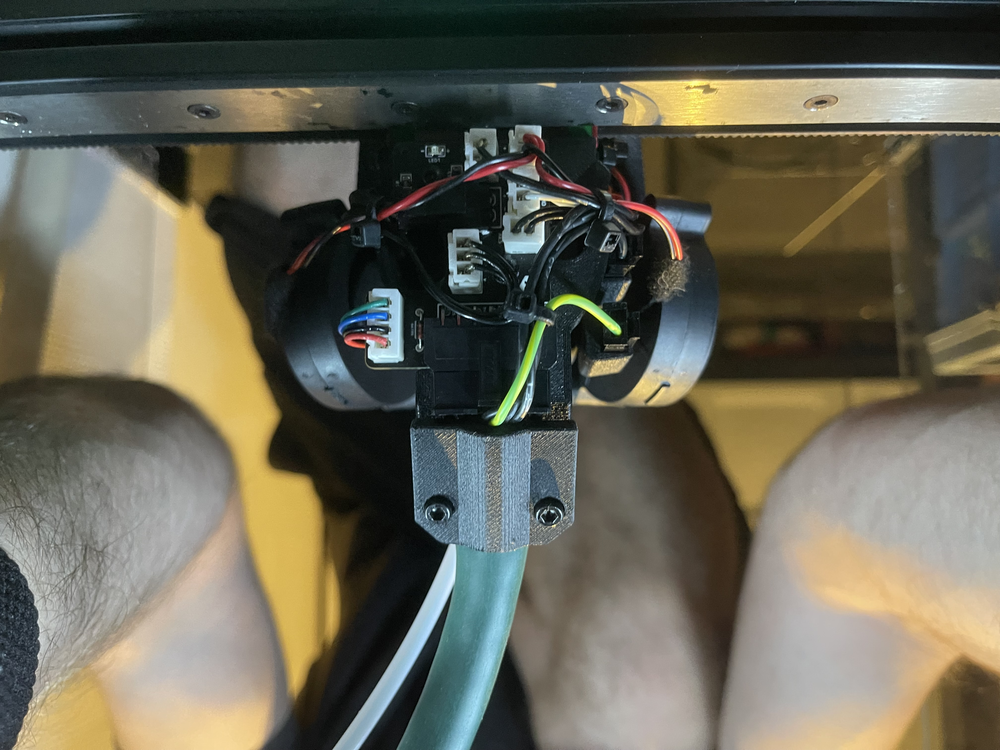

# LGX Lite Umbilical Mounting including Hartk1213's P Toolhead PCB 4.0 Mount

| BOM | Pieces |
| ------ | ------ |
| M3 Heatinsert | 4 |
| M3x8MM | 1 |
| M3x6MM | 2 |
| M3x4MM | 2 |

❗ATTENTION ❗
 Confirmed to work with
 
✖️ MGN12H NATIVE EUCLID CARRIAGE 

✖️Henrikssn's Carriage (on Kayosmakers repo, yet to be merged)

✖️Kayosmaker's Carriage (on his repo, yet to be merged)

Works best with this [Rear Umbilical Mod](https://github.com/Minsekt/MantisUsermods/tree/main/Usermods/Minsekt/LGX_Lite_Umbilical) of me.

